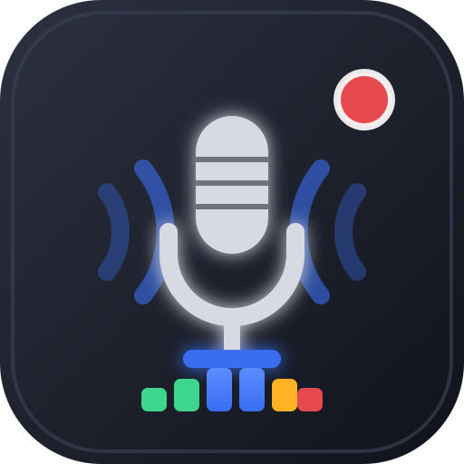

<p align="center">
  
</p>

# AudioScene – OBS für Audio

**AudioScene** ist wie OBS – nur für Sound. Du fügst **Anwendungs-Audio** und **Audiogeräte** als Quellen hinzu, mischst sie im Mixer und nimmst alles mit einem Klick auf.


> Doku-Website (GitHub Pages): siehe Ordner [`docs/`](docs/) – dort wird erklärt, wie alles funktioniert. Aktuell bewusst **ohne Download-/Installer-Button**.

## Features (v0.3)

- **Menüs wie in OBS:** Datei (Einstellungen…, Aufnahme-Ordner öffnen, Beenden),
  Ansicht (Docks ein-/ausblenden, Layout zurücksetzen), Werkzeuge (neue Docks adden), Hilfe (Über)
- **Docks per Drag & Drop** an der Titelleiste umordnen – Reihenfolge, Sichtbarkeit
  und Extra-Docks werden automatisch gespeichert
- **Extra-Docks unter Werkzeuge:** Aufnahme-Verlauf, Master-Pegel (mit Clip-LED), Statistik
- **Szenen + Quellen wie in OBS** (alles wird automatisch gespeichert)
  - Szenen anlegen, umbenennen (Doppelklick), löschen, sortieren – nur die aktive Szene läuft auf den Master
  - 🖥️ Anwendungs-Audio: **Fenster-/Bildschirm-Liste mit Icons** (alle aufnehmbaren Prozesse),
    gezieltes Capture, Fallback auf manuellen System-Dialog
  - 🎤 Eingabegerät (Mikrofon / Headset, wählbar, in Eigenschaften wechselbar, nach Neustart auto-verbunden)
  - 🔈 Ausgabegerät / System-Sound (Loopback, offline-Platzhalter nach Neustart → „Fenster erneut wählen“)
- **Quellen-Eigenschaften** (Doppelklick oder ⚙): umbenennen, Gerät wechseln, Lautstärke
- **Audio-Mixer** mit Lautstärke-Slider, Mute, Live-VU + Peak-Hold und Clip-Warnung pro Quelle
- **Mithören-Toggle** (Master-Monitoring, standardmäßig aus gegen Feedback)
- **Wellenform-Vorschau** (statt Video-Vorschau) + REC-Badge + Timer + Live-Dateigröße
- **⏺ Aufnahme-Button** (Hotkey Standard: `F9`, Eingabefelder ausgenommen), MediaRecorder im Mix-Bus
- **Einstellungen wie in OBS:**
  - Ausgabe-Ordner, Dateiname-Vorlage (`%Y %m %d %H %M %S`), Standard-Format umschaltbar:
    WebM (Opus), OGG (Opus), MP3 (via lamejs, `src/vendor`), WAV (echtes 16-bit PCM), M4A (AAC, falls vom System unterstützt)
  - Sample-Rate (44.1 / 48 kHz), Kanäle (Mono mit Downmix / Stereo)
  - Bitrate (64–320 kbps, gilt für Opus/MP3 – WAV ist unkomprimiert)
- **Automatischer Aufnahme-Ordner auf Windows:**
  - Nutzt `app.getPath('music')` → löst automatisch den lokalisierten Ordner auf
  - DE: `C:\Users\<du>\Musik\AudioScene` · EN: `...\Music\AudioScene`
  - Es wird **nie** ein Pfad hardcodiert. Der Ordner wird bei Start erstellt.

## Projekt starten

```bash
npm install
npm start
```

Build (später, portable – noch kein öffentlicher Download):

```bash
npm run dist
```

## Speicherort-Logik (wichtig)

```js
const music = app.getPath('music'); // → Musik / Music, je nach Windows-Sprache
const dir = path.join(music, 'AudioScene');
fs.mkdirSync(dir, { recursive: true });
```

So funktioniert es auf Deutsch, Englisch und allen anderen Sprachen – ohne raten, ob der Ordner `Audio`, `Musik` oder `Music` heißt.

## Roadmap

- [ ] Natives WASAPI-Loopback (ohne System-Dialog, pro App wählbar)
- [ ] WASAPI-Geräteliste nativ (statt Browser-enumerateDevices)
- [ ] MP3 / FLAC / Opus-Export via FFmpeg
- [ ] Filter: Noise-Gate, Kompressor, EQ
- [ ] Echte Szenen-Umschaltung mit getrennten Mixern
- [ ] Installer (NSIS) – erst wenn stabil, aktuell kein Download-Button auf der Page

## Tech

- Electron 33, Web Audio API (Gain + Analyser pro Quelle → Master-Bus), MediaRecorder
- OBS-inspirierte UI: Menüleiste, Docks (Szenen / Quellen / Mixer / Steuerung), Statusleiste

MIT License – gebaut von Lokrogaming.
